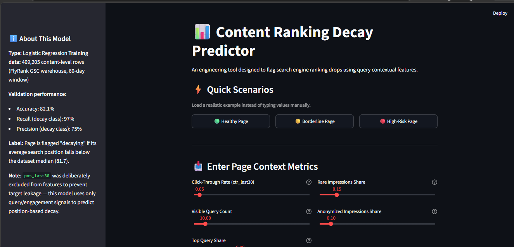

# Portfolio — Fizzah Amir

## 1. Replace placeholders with real captures
Every `[ ... ]` box in the HTML is a placeholder — replace before submitting:

| Placeholder | File | What to add |
|---|---|---|
| Headshot | `about.html` (`.headshot` div) | Real photo, `` inside the div, drop old text |
| Streamlit dashboard | `index.html` + `projects.html#flyrank` | Screenshot of your FlyRank app, cropped, no browser chrome |
| Power BI dashboard | `index.html` + `projects.html#ai-jobs` | Cropped Power BI visual |
| Chart/notebook | `index.html` + `projects.html#superstore` | High-res chart export (matplotlib `dpi=200+`) |
| LinkedIn URL | `contact.html` | Swap the `href="#"` |

Save images into `assets/img/` and swap each placeholder `<div>` for an `` tag, e.g.:
```html

```

## 2. Deploy to GitHub Pages
1. Push this folder's contents to a repo (or a `docs/` folder / `gh-pages` branch of your existing repo)
2. Repo → Settings → Pages → set source to that branch/folder
3. Your site goes live at `https://fizzah-amir14.github.io/<repo-name>/`

## 3. For the "Kill your darlings" assignment deliverable
Use this as your submission draft:

**Keepers:**
- Real screenshots: Streamlit dashboard, Power BI dashboard, Superstore chart — all real captures of my own work
- Real photo: headshot on About page
- Generated connective tissue: two abstract navy/bronze node-graph SVG motifs (`motif-1.svg`, `motif-2.svg`) — one consistent line-art style, used as subtle hero accents across all four pages

**Rejected:**
- *(write 1–2 lines once you've actually tried some AI generations, e.g.:)* "Generated a photorealistic 3D dashboard mockup for the hero — rejected because it looked like generic stock AI art and visually competed with my real Streamlit screenshot instead of framing it."

**Where I chose a real capture over AI:** all three project screenshots and the headshot — a generated mockup would misrepresent my actual work and a generated face is off-limits per the brief.
